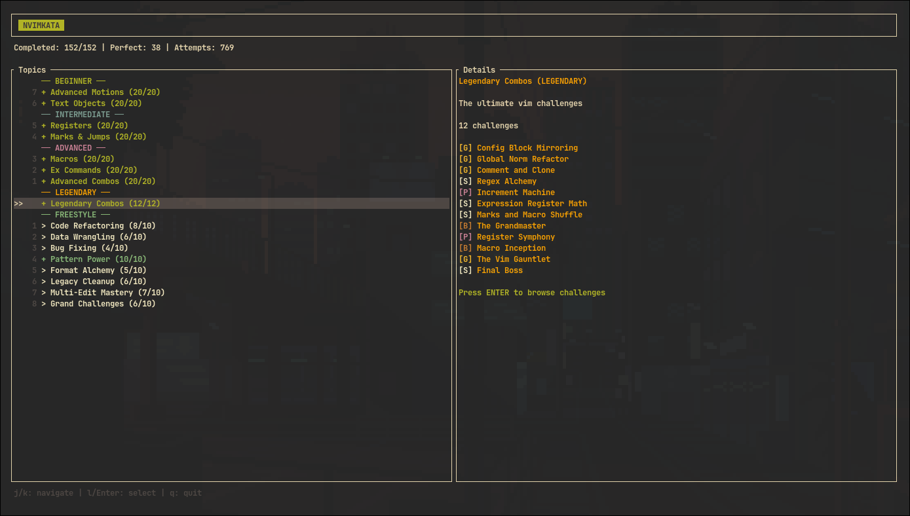

# nvimkata

*For the things we have to learn before we can do them, we learn by doing them. - Aristotle*

Practice efficient editing in Neovim. A TUI drops you into real Neovim, with your own config, and counts every keystroke as you edit a target buffer. Over 200 challenges from basic motions to legendary combos, with categories that unlock as you progress. Each challenge has a par keystroke count and is graded A through F based on how close you get.



## Usage

```bash
nix run github:tupakkatapa/nvimkata
```

Inside a challenge, the screen splits into a read-only target diff on top and your editable buffer below. Edit until the diff disappears, or `:w` to finish early. Press `F1` to cycle through hints. Progress persists to `~/.local/share/nvimkata/save.json` or `./save.json` if it exists.
